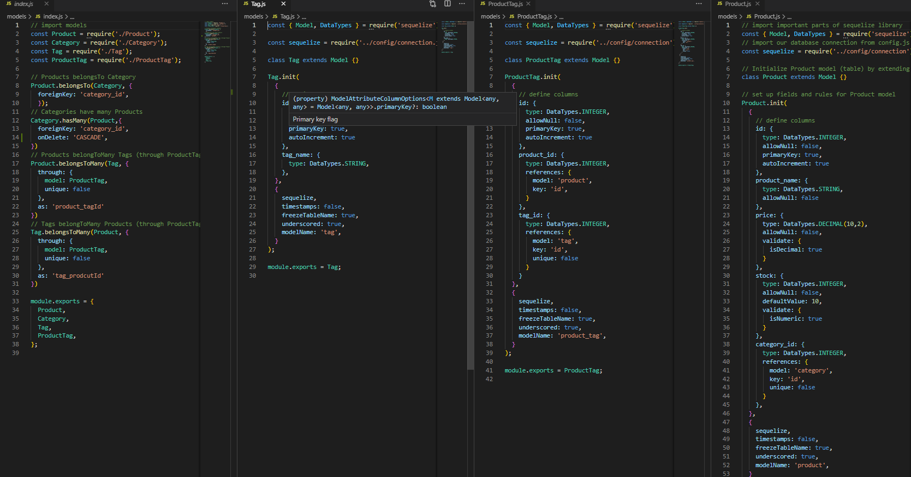
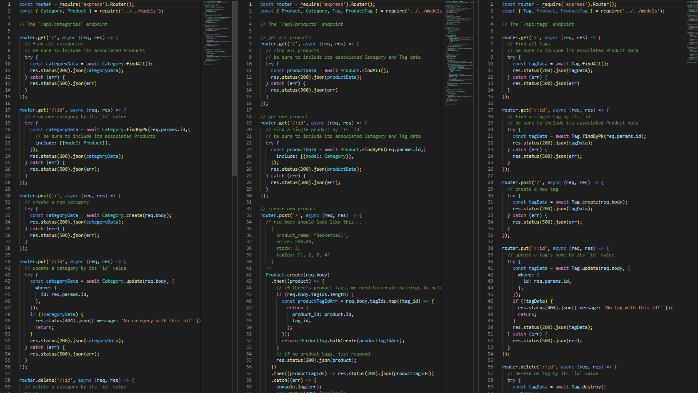
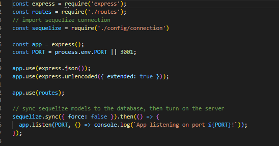

# ECommerce-App

## The Task

Internet retail, also known as **e-commerce**, is the largest sector of the electronics industry, generating an estimated $29 trillion in 2019. E-commerce platforms like Shopify and WooCommerce provide a suite of services to businesses of all sizes.

The task is to build the back end for an e-commerce site. I’ll configure an Express.js API to use Sequelize to interact with a MySQL database.

## Skills Used
* JAVASCRIPT
* NODE.JS
* EXPRESS
* SEQUELIZE
* MYSQL
* MYSQL WORKBENCH
* POSTMAN

## How can this app be installed and tested?
This application has to be ran in a terminal that has node.
The command to run the app is 
> node server

then we can seed the database created through
> npm run seed

then run server again to start working with postman
> node server

## Code

## Video Walkthrough
[Walkthrough] 

## Credits

Jesus Milan

[GitHub:] https://github.com/Milan1422